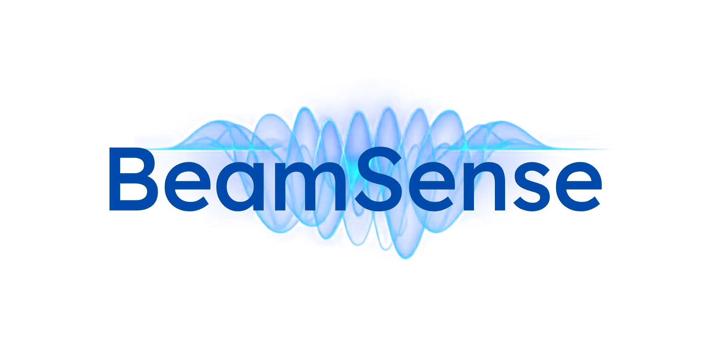

Have you ever wondered how particle accelerators store and use energy? In large research facilities, such as particle accelerators, special devices called RF cavities use electromagnetic fields to accelerate charged particles. This project tries to explain the Quality Factor (Q-Factor), one of the parameters of said cavities.

### Who is this for?

A great learning activity for yourself, your students (e.g., A-level), or general public, specially those who are curious about the science behind particle accelerators.

### Project goal

Provide guidance for building and measuring the Q-Factor of DIY cavities through the following:

*	Instructions for constructing the base experimental setup.
*	Step-by-step procedure for measuring the resonant frequency and Q-Factor.
*	Brief theory on how resonance and energy storage concepts are used in accelerator science.

### Authors

* Alex Whitehead1,2
* Ana Guisao-Betancur3,4
* Divya5,6
* Flanish Ashley D'Souza7

**Affiliations:** 

1. ELI Beamlines Facility, The Extreme Light Infrastructure ERIC, Dolní Břežany, Czech Republic
2. Czech Technical University in Prague, Faculty of Nuclear Sciences and Physical Engineering, Prague, Czech Republic
3. University of Liverpool, Liverpool, UK
4. The Cockcroft Institute, Daresbury, UK
5. TU Wien, Vienna, Austria
6. CIVIDEC Instrumentations GmbH, Vienna, Austria
7. Department of Physics, Lund University, Lund, Sweden

<figure>
  
</figure>

### Funding statement

This project has received funding from the European Union's Horizon Europe research and innovation programme under grant agreement no. 101073480 and the UKRI guarantee funds.

> ### Licenses
>
> **Instructions, documentation:** Creative Commons Attribution Share Alike 4.0

 
  

