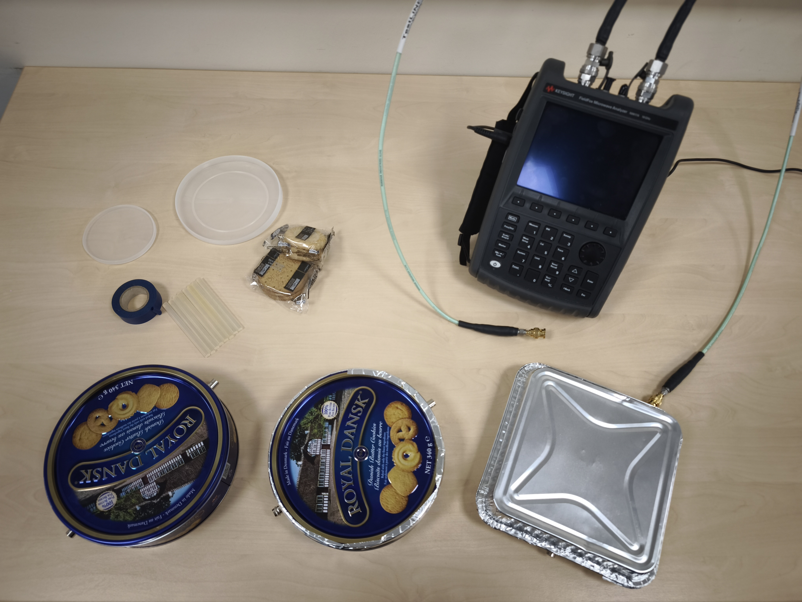
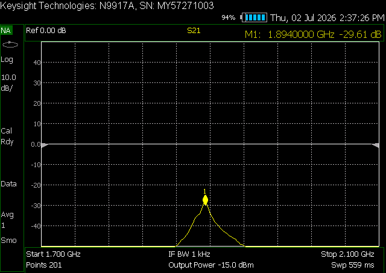
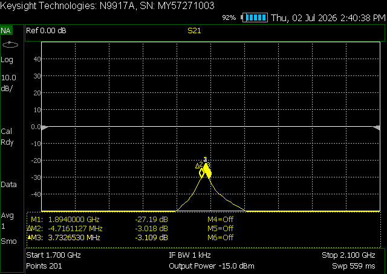
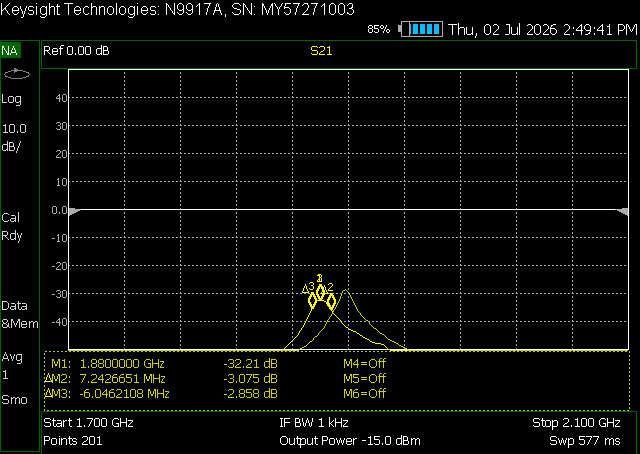
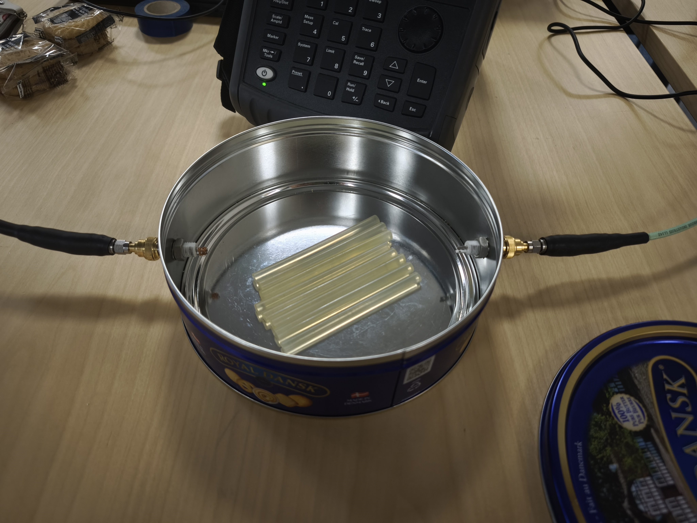
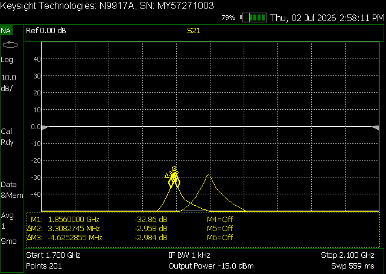
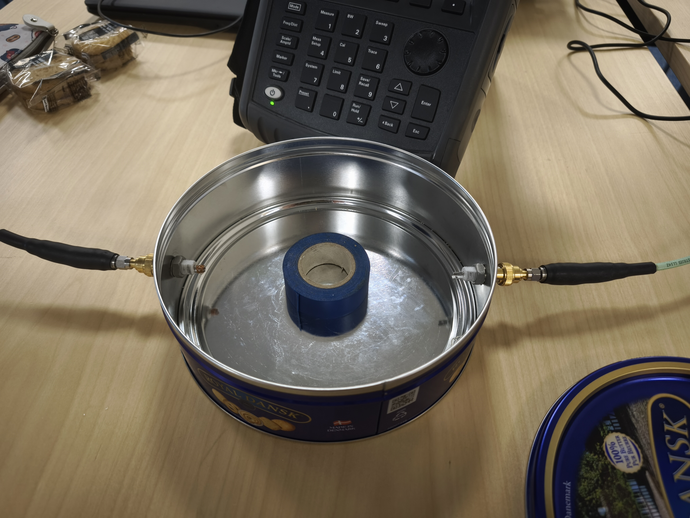
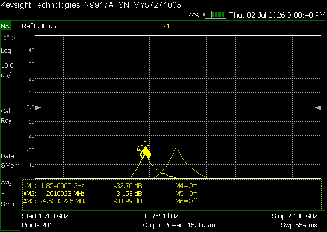
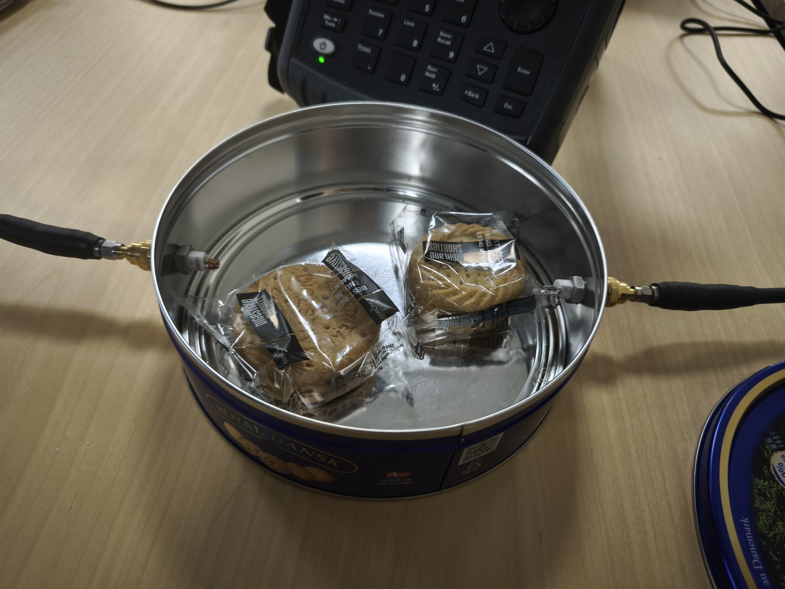
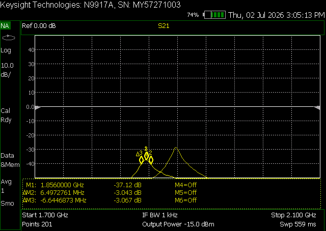

# Introduction


The aim of this project is to understand the Quality Factor (Q-factor), a single number that describes how well a resonant system stores energy. Formally, it compares the energy stored in a system to the energy lost in each cycle of oscillation: a high Q-factor means energy stays in the system for a long time, and little is lost, while a low Q-factor means energy is dissipated quickly. In a particle accelerator, the radio-frequency (RF) cavities that push particles up to high energies depend on a high Q-factor — the less energy a cavity wastes as heat, the more efficiently it can build up the strong oscillating electric fields used to accelerate the beam.

To explore this idea, we work in two stages. First, we build an equivalent analog circuit (a parallel inductor–capacitor (LC) circuit) which resonates in the same way a cavity does and lets us see directly how inductance and capacitance set the resonant frequency. We then measure the Q-factor of a homemade cavity (a metal biscuit tin) using a Vector Network Analyzer (VNA). 


The activity is suitable for teachers, students, or just someone interested in particle accelerators.


# Bill of materials

This is a suggested list of materials, but make this demonstration your own by exchanging for the materials you have available in your lab, house, or nearest store.

1. DIY cavities:  metal biscuit tin with a lid (a round tin behaves like a classic "pillbox" cavity). Include other DIY cavities that you can think of!
2. Drill or bradawl to make holes for the probes or SMA connectors.
3. Two SMA connectors or coupling probes to use the transmission (S21) method.
4. Vector network analyser (VNA) and coaxial cables in a frequency range that covers your tin's resonance.
5. Dielectric materials that can fit inside the cativity to test.

<figure>
  
  <figcaption>Materials.</figcaption>
</figure>


# Experimental setup

## Part 1: analog LC circuit

For this part prepare a circuit in a project board or electronics simulation software according to preference or availability.

<iframe width="560" height="315" src="https://www.youtube.com/embed/2vCBWpJT0Bk?si=EtnpNeQEOrjrLBM5" title="YouTube video player" frameborder="0" allow="accelerometer; autoplay; clipboard-write; encrypted-media; gyroscope; picture-in-picture; web-share" referrerpolicy="strict-origin-when-cross-origin" allowfullscreen></iframe>

See the tab *"RF cavities and Quality factor"* for the concepts of resonant frequency $f_0$ and relation with capacitance $C$ and inductance $L$:

$$f_0 = \frac{1}{2\pi \sqrt{L \cdot C}}$$

## Part 2: Q-factor measurement


1. Prepare the cavities

Measure your tin's internal radius and height and use $f_0$ to estimate the relevant resonance. This tells you which band to sweep and whether your VNA can reach it.

2. Calibrate and connect

Calibrate the VNA according to your instrument's procedure. Use two ports drive port 1 into one probe and measure the transmitted signal on port 2 (S21).

Do a broad frequency sweep first and you will see several peaks corresponding to different resonant modes of the tin. Identify the one that matches your predicted frequency.

Narrow the sweep around that peak so you can read it precisely.

<figure>
  
  <figcaption>Finding the peak and central frequency.</figcaption>
</figure>

3. Read $f_0$ and the bandwidth 

Note the centre frequency $f_0$ at the top of the peak, then find the $−3$dB points either side ($3$dB down from the peak). The gap between them is $\Delta f$. 

<figure>
  
  <figcaption>Finding the bandwidth.</figcaption>
</figure>

For this specific VNA the bandwidth is measured in two steps, one $\Delta_{left}$ to the left of the peak and a second one to the right $\Delta_{right}$ for a total added $\Delta f = |\Delta_{left}| + |\Delta_{rigth}|$.

4. Calculate Q

In this example:

$$Q = \frac{f_0}{\Delta f} \approx \frac{1.89\times10^{9}} {(4.72+3.73)\times10^{6}} \approx 223$$

```markdown
For contrast, compare this with the Q you found for the LC circuit, and with the 10^9 - 10^10 values of real superconducting accelerator cavities.
 
```

5. Measure the change in $f$ by placing the dielectrics inside

Place your selection of dielectrics one by one inside the cavity and observe the changes: shift in the resonant frequency $f_0 \rightarrow f$, attenuation, etc. Some examples here (for all, the trace of the original without dielectric is shown for comparison and the picture is taken before placing the metallic lid to close the cavity):

a. Small lid

<figure>
  
</figure>

<figure>
  
</figure>

$$ f_0 - f \approx - 14\text{ MHz}$$
b. Big lid

<figure>
  
</figure>

<figure>
  
</figure>

$$ f_0 - f \approx - 14\text{ MHz}$$
c. Glue

<figure>
  
</figure>

<figure>
  
</figure>

$$ f_0 - f \approx - 38\text{ MHz}$$
d. Tape

<figure>
  
</figure>

<figure>
  
</figure>

$$ f_0 - f \approx - 40\text{ MHz}$$
e. Biscuits (with packaging)

<figure>
  
</figure>

<figure>
  
</figure>

$$ f_0 - f \approx - 38\text{ MHz}$$


```markdown
Experiment. Compare a well-seated lid vs. a slightly loose one, or a bare-metal tin vs. a painted one, see how/if the values change.
```


> ### Licenses
>
> **Instructions, documentation:** Creative Commons Attribution Share Alike 4.0
